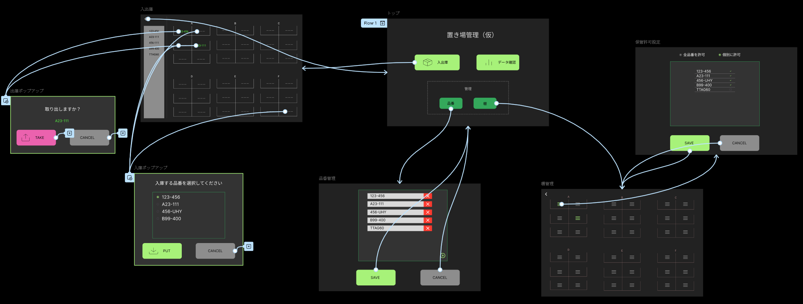
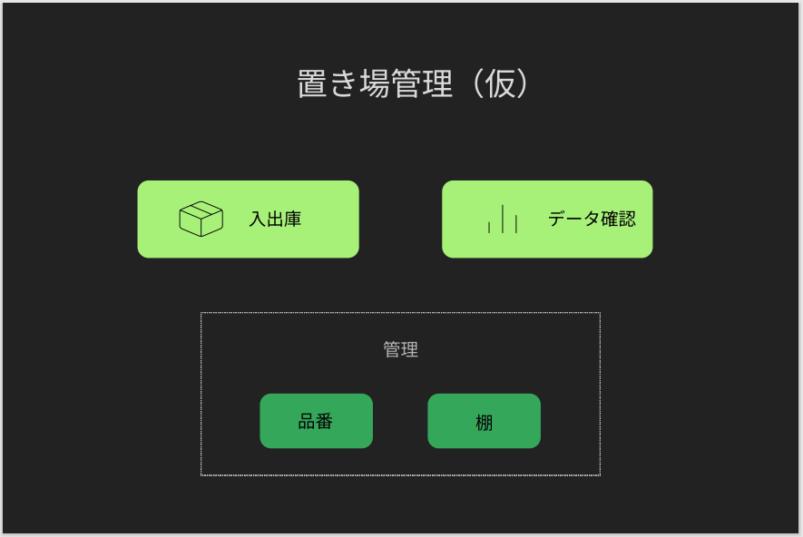
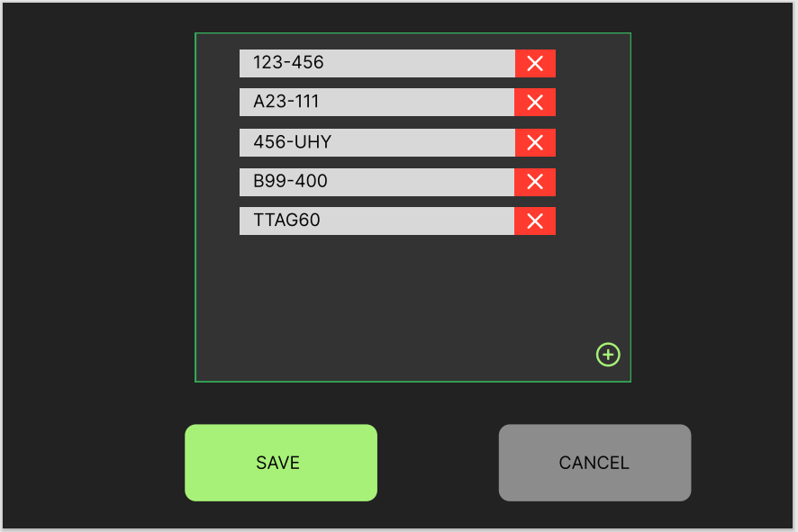
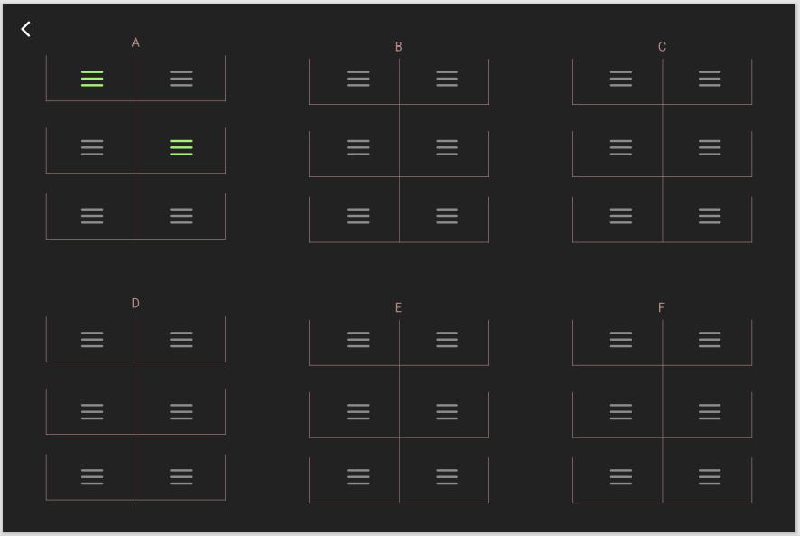
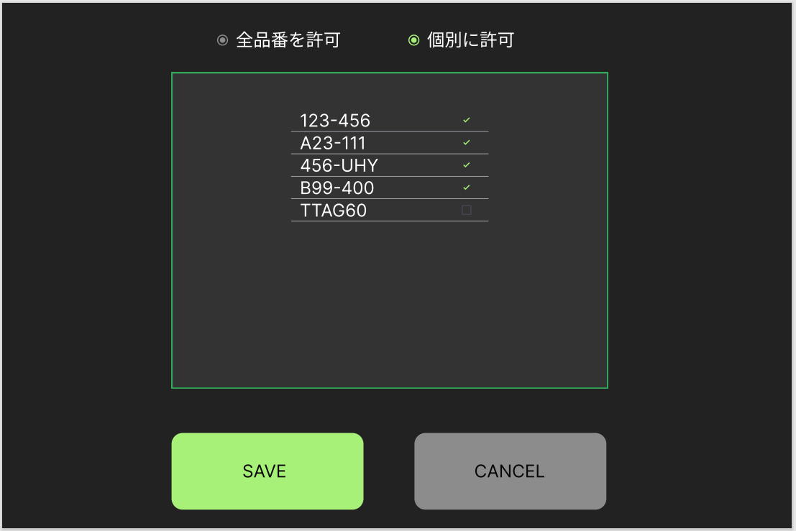
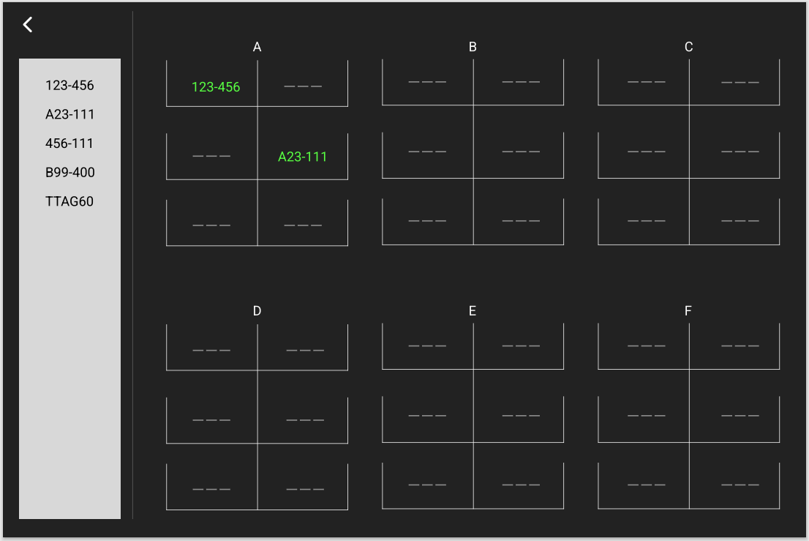
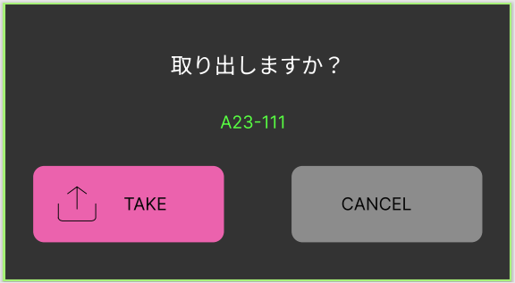
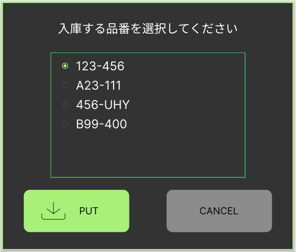

# StockTrack（仮）

## 概要
長尺材の置き場管理をおこなうWEBアプリケーション。
置き場への設置と取り出しの際に、何をどこに置いたか/取り出したかを入力することで、。
長尺材の置き場を把握する。
また、出し入れの記録データを使った分析をおこなう（予定）。

## 機能一覧
以下の機能を持つ。
- 品番設定機能
  - 棚に置かれる長尺材の品番マスターを管理する機能。
- 棚管理機能
  - 棚には複数のセルがある。棚の１セルごとに保管してよい品番の許可設定をする機能。
- 入出庫記録機能
  - マップ上に、どの棚に何が保管されているか、一覧を表示する。
  - 棚への出し入れの際に次の情報を記録する。
    - 品番
    - 棚番号
    - セル番号
- データ確認機能
  - 今後実装を検討予定。

## 画面一覧
以下の画面を持つ。
- トップ
- 品番管理
- 棚管理
- 保管許可設定
- 入出庫

### 画面遷移

## 各画面の仕様

### トップ

- 入出庫ボタン
    - 押下時、入出庫画面へ遷移する。
- データ確認ボタン
    - 未実装とする。ボタンは設置し、disabledにしておく。
- 品番ボタン
    - 押下時、品番管理画面へ遷移する。
- 棚ボタン
    - 押下時、棚管理画面へ遷移する。

### 品番管理

- 品番リスト
    - サーバーに登録されている品番を表示する。ただし、論理削除されている品番は表示しない。
    - 並び順は文字の降順とする。
    - 枠を超える場合はスクロールバーを表示する。
  - 品番
  - 削除ボタン（✖ボタン）
    - 押下時、品番リストから該当品番を削除する。
- プラスボタン
    - 品番リストに品番を一行追加する。新しく追加される品番の初期値は"new"とする。
- SAVEボタン
    - 押下時、品番リストに加えられた変更内容をサーバーに反映する。
    - ユーザーに削除された品番はサーバー上は論理削除とする。
    - 同名の品番がある場合、１件だけを登録する。
    - サーバー側では品番ごとにユニークな内部IDを付与する。
    - サーバーへの反映処理終了後はトップ画面に遷移する。
    - 棚に保管中の品番を削除しようとした場合、その品番の論理削除はせず、「品番"xxxxxx"は保管中のため削除できませんでした。」のメッセージをalertで表示する。alertをユーザーが閉じたとき、トップ画面に遷移する。
    - 反映処理に失敗した場合、「保存処理に失敗しました。」のメッセージをalertで表示する。
- CANCELボタン
  - 変更を反映しないでトップ画面に遷移する。
  - 品番リストに変更が加えられている場合、「変更内容を破棄してもよろしいですか？YES/NO」のメッセージを表示する。

### 棚管理

- 戻るボタン（"<"ボタン）
  - 押下時、トップ画面に遷移する
- マップ表示
  - 上のような画像を表示する。
  - 各セル毎に設定ボタンを表示する。
- 設定ボタン（横線３本ボタン）
  - 押下時、保管許可設定画面へ遷移する。
  - ボタンの色について
    - 緑色：保管許可設定画面で、１つ以上の品番が設定されている場合
    - 灰色：保管許可設定画面で、品番が設定されていない場合

### 保管許可設定

- ラジオボタン
  - 全品番を許可が選択されているとき
    - 全ての品番の保管を許可する。
    - 品番リストはグレーアウトし、操作不可にする。
    - 初期状態は「全品番を許可」とする。
  - 個別に許可が選択されるとき
    - 品番リストを有効化する。
- 品番リスト
  - サーバーに登録されている品番を表示する。ただし、削除されている品番は表示しない。
  - 並び順は文字の降順とする。
  - 枠を超える場合はスクロールバーを表示する。
  - チェックボックスの初期状態：保管許可が設定されている品番はチェックON。
  - チェックボックスは編集可能
  - 品番は編集不可
- SAVEボタン
  - 押下時、品番リストに加えられた変更内容をサーバーに反映する。
- CANCELボタン
  - 変更を反映しないで棚管理画面に遷移する。
  - 品番リストに変更が加えられている場合、「変更内容を破棄してもよろしいですか？YES/NO」のメッセージを表示する。

### 入出庫

- 戻るボタン（"<"ボタン）
  - 押下時、トップ画面に遷移する。
- 品番選択ボタン
  - 削除されていない品番全てが表示される。
  - 品番選択時、その品番を保管可能なセルが強調表示される。
  - 選択中の品番を再度押下したときは選択状態が解除される。
- マップ表示
  - 上のような画像を表示する。
  - 各セル毎に保管されている品番を表示する。（保管状況の表示）
  - 保管されていない場合は空であることを表す"ーーー"を表示する。
- 品番
  - 押下時、出庫ポップアップを表示する。
- "ーーー"
  - 押下時、入庫ポップアップを表示する。

#### 出庫ポップアップ

- 品番
  - 入出庫画面で選択された品番を表示する。
- TAKEボタン
  - 押下時、サーバーに出庫を反映する。
  - 正常に反映された場合、ポップアップを閉じる。
  - 入出庫画面のマップ上の保管状況表示を更新する。
  - 反映処理に失敗した場合、「出庫処理に失敗しました。」のメッセージをalertで表示する。
- CANCELボタン
  - ポップアップを閉じる。

#### 入庫ポップアップ

- 品番リスト
  - 該当セルに保管許可された品番のリストを表示する。
  - 品番ごとにオプションボタンを配置する。
  - 初期選択状態
    - 通常時：未選択
    - 強調表示中：リストで選択中の品番
  - 枠を超える場合はスクロールバーを表示する。
- PUTボタン
  - 押下時、サーバーに選択された品番の入庫を反映する。
  - 正常に反映された場合、ポップアップを閉じる。
  - 入出庫画面のマップ上の保管状況表示を更新する。
  - 反映処理に失敗した場合、「入庫処理に失敗しました。」のメッセージをalertで表示する。
- CANCELボタン
  - ポップアップを閉じる。

## DB
|                  |                                                                 |
| ---------------- | --------------------------------------------------------------- |
| 品番マスタ       | 品番マスタ　品番、削除コード                                    |
| 棚マスタ         | 棚ID、棚名                                                      |
| セルマスタ       | セルID、セル名、棚ID                                            |
| 保管許可設定     | セルID、品番ID                                                  |
| 保管状況         | セルID、品番ID                                                  |
| 入タイムスタンプ | セルID、品番、入出庫区分出庫ログ　 品番マスタ　品番、削除コード |

## 補足

許可設定がすでにされている品番を、品番マスタから削除した時
許可設定テーブルは操作しない。
ただし、許可設定画面には、品番マスタから削除された品番を表示しない。
品番マスタに、過去に消された品番を再度登録した場合
品番マスタの過去のレコードの削除コードをfalseにする
・・・結果、許可設定も有効になる

## メモ

- 5/20 13:00
  保管許可設定を「全品番を許可」と「個別に許可」の2パターン用意することになった。
  個別に許可のときだけリストから選択できるように。
  ・・・**全品番許可の状態をどう扱うか、テーブル再検討が必要。**　

- 5/20 13:00
  入出庫画面で、「この品番はどこに置くことができるか」が表示される機能を追加。
  画面左側のリストから品番を選択することで、その品番の保管許可が設定されているセルを強調表示する。
  強調表示中に入庫ポップアップをひらくと、その品番が選択された状態でポップアップする。

